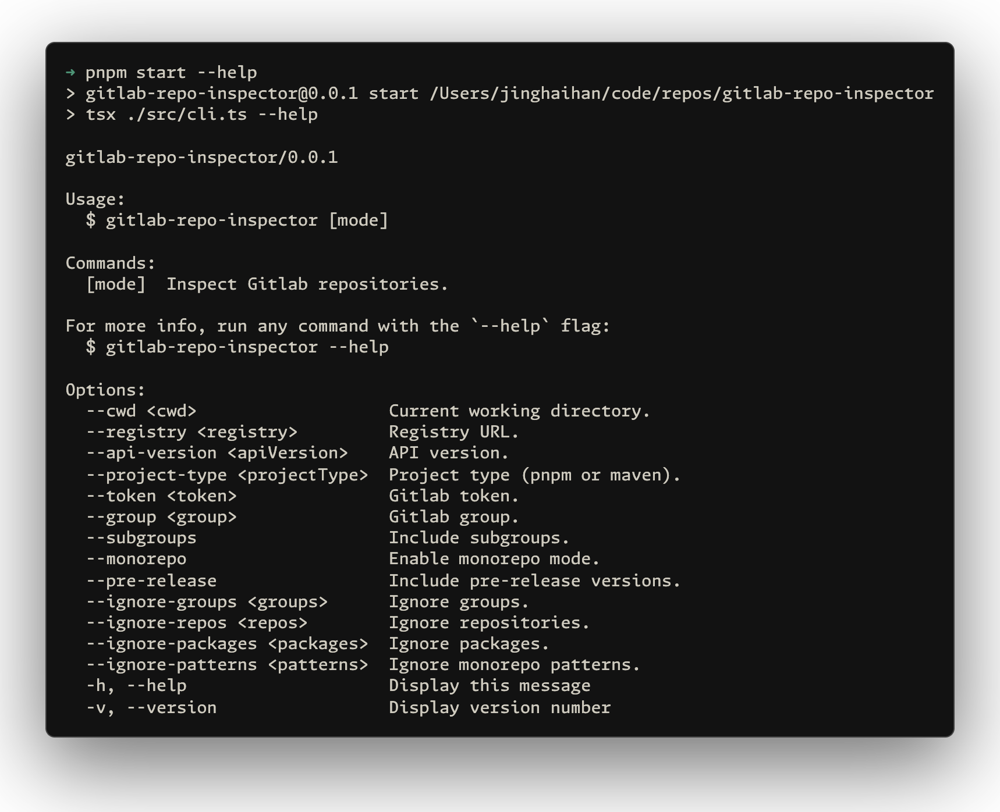

# gitlab-repo-inspector

[![npm version][npm-version-src]][npm-version-href]
[![JSDocs][jsdocs-src]][jsdocs-href]
[![License][license-src]][license-href]

A tool to scan GitLab groups and subgroups, list all repositories, detect monorepos, and fetch the latest tags or releases.

```bash
npx gitlab-repo-inspector [mode] [options]
```

### Command Line Options

```bash
# Basic usage
npx gitlab-repo-inspector --token <token> --group <group>

# With additional options
npx gitlab-repo-inspector manifest \
  --cwd /path/to/project \
  --registry https://gitlab.example.com \
  --api-version v4 \
  --project-type pnpm \
  --token <token> \
  --per-page 100 \
  --group <group> \
  --subgroups \
  --archived \
  --monorepo \
  --pre-release \
  --ignore-groups "legacy,deprecated" \
  --ignore-repos "old-repo,test-repo" \
  --ignore-packages "internal-pkg" \
  --ignore-patterns "playground,examples/*" \
  --json output.json \
  --merge
```

<p align='center'>

</p>

## Features

### Repository Discovery
- Scans GitLab groups and subgroups recursively
- Fetches repository metadata including descriptions and latest tags
- Supports both GitLab.com and self-hosted GitLab instances

### Monorepo Detection
The tool automatically detects and analyzes monorepo structures:

**pnpm Workspaces:**
- Reads `pnpm-workspace.yaml` to discover workspace packages
- Extracts package information from `package.json` files
- Supports workspace patterns like `packages/*`

**Maven Projects:**
- Parses `pom.xml` files to discover multi-module projects
- Recursively analyzes nested modules
- Extracts artifact information and descriptions

## Configuration

Create a `gitlab-repo-inspector.config.ts` file to customize default settings:

```ts
import { defineConfig } from 'gitlab-repo-inspector'

export default defineConfig({
  cwd: process.cwd(),
  registry: 'https://gitlab.com',
  apiVersion: 'v4',
  projectType: 'pnpm',
  token: 'access-token',
  perPage: 500,
  group: 'gitlab-group',
  subgroups: true,
  archived: false,
  monorepo: true,
  preRelease: false,
  ignoreGroups: ['legacy'],
  ignoreRepos: ['decrypted-repo'],
  ignorePackages: ['internal-packages'],
  ignorePatterns: ['playground', 'examples/*'],
  json: 'gitlab-repo-inspector.json',
  merge: false
})
```

**Configuration Options:**
- `cwd`: Current working directory
- `registry`: GitLab instance URL
- `apiVersion`: API version (default: 'v4')
- `projectType`: Project type ('pnpm' or 'maven')
- `token`: GitLab access token
- `perPage`: Number of repositories per page (default: 500)
- `group`: Default group to scan
- `subgroups`: Include subgroups in scan (default: true)
- `archived`: Include archived repositories (default: false)
- `monorepo`: Enable monorepo detection (default: true)
- `preRelease`: Include pre-release versions (default: true)
- `ignoreGroups`: Array of group names to ignore
- `ignoreRepos`: Array of repository names to ignore
- `ignorePackages`: Array of package names to ignore
- `ignorePatterns`: Array of monorepo patterns to ignore
- `json`: Output JSON file name (default: 'gitlab-repo-inspector.json')
- `merge`: Merge with existing JSON file (default: false)

## Authentication

The tool requires a GitLab access token with appropriate permissions:

1. Go to GitLab → Settings → Access Tokens
2. Create a token with `read_repository` and `read_api` scopes
3. Provide the token via:
   - `--token` command line option
   - Configuration file
   - Interactive prompt (if not provided)

## License

[MIT](./LICENSE) License © [jinghaihan](https://github.com/jinghaihan)

<!-- Badges -->

[npm-version-src]: https://img.shields.io/npm/v/gitlab-repo-inspector?style=flat&colorA=080f12&colorB=1fa669
[npm-version-href]: https://npmjs.com/package/gitlab-repo-inspector
[npm-downloads-src]: https://img.shields.io/npm/dm/gitlab-repo-inspector?style=flat&colorA=080f12&colorB=1fa669
[npm-downloads-href]: https://npmjs.com/package/gitlab-repo-inspector
[bundle-src]: https://img.shields.io/bundlephobia/minzip/gitlab-repo-inspector?style=flat&colorA=080f12&colorB=1fa669&label=minzip
[bundle-href]: https://bundlephobia.com/result?p=gitlab-repo-inspector
[license-src]: https://img.shields.io/badge/license-MIT-blue.svg?style=flat&colorA=080f12&colorB=1fa669
[license-href]: https://github.com/jinghaihan/gitlab-repo-inspector/LICENSE
[jsdocs-src]: https://img.shields.io/badge/jsdocs-reference-080f12?style=flat&colorA=080f12&colorB=1fa669
[jsdocs-href]: https://www.jsdocs.io/package/gitlab-repo-inspector
