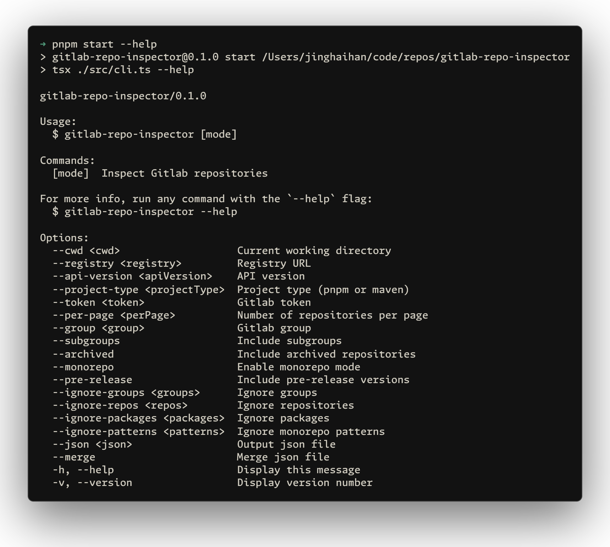

# gitlab-repo-inspector

[![npm version][npm-version-src]][npm-version-href]
[![JSDocs][jsdocs-src]][jsdocs-href]
[![License][license-src]][license-href]

A tool to scan GitLab groups and subgroups, list all repositories, detect monorepos, and fetch the latest tags or releases.

```bash
npx gitlab-repo-inspector [options]
```

<p align='center'>

</p>

## Features

### Repository Discovery
- Scans GitLab groups and subgroups recursively
- Fetches repository metadata including descriptions and latest tags
- Supports both GitLab.com and self-hosted GitLab instances

### Monorepo Detection
The tool automatically detects and analyzes monorepo structures:

**pnpm Workspaces:**
- Reads `pnpm-workspace.yaml` to discover workspace packages
- Extracts package information from `package.json` files
- Supports workspace patterns like `packages/*`

**Maven Projects:**
- Parses `pom.xml` files to discover multi-module projects
- Recursively analyzes nested modules
- Extracts artifact information and descriptions

## Configuration

Create a `gitlab-repo-inspector.config.ts` file to customize default settings:

```ts
import { defineConfig } from 'gitlab-repo-inspector'

export default defineConfig({
  registry: 'https://gitlab.com',
  token: 'access-token',
  group: 'gitlab-group',
  subgroups: true,
  monorepo: true,
  preRelease: false,
  ignoreGroups: ['legacy'],
  ignoreRepos: ['decrypted-repo'],
  ignorePackages: ['internal-packages'],
  ignorePatterns: ['playground', 'examples/*']
})
```

**Configuration Options:**
- `registry`: GitLab instance URL
- `token`: GitLab access token
- `group`: Default group to scan
- `subgroups`: Include subgroups in scan
- `monorepo`: Enable monorepo detection
- `preRelease`: Include pre-release versions
- `ignoreGroups`: Array of group names to ignore
- `ignoreRepos`: Array of repository names to ignore
- `ignorePackages`: Array of package names to ignore
- `ignorePatterns`: Array of monorepo patterns to ignore

## Authentication

The tool requires a GitLab access token with appropriate permissions:

1. Go to GitLab → Settings → Access Tokens
2. Create a token with `read_repository` and `read_api` scopes
3. Provide the token via:
   - `--token` command line option
   - Configuration file
   - Interactive prompt (if not provided)

## License

[MIT](./LICENSE) License © [jinghaihan](https://github.com/jinghaihan)

<!-- Badges -->

[npm-version-src]: https://img.shields.io/npm/v/gitlab-repo-inspector?style=flat&colorA=080f12&colorB=1fa669
[npm-version-href]: https://npmjs.com/package/gitlab-repo-inspector
[npm-downloads-src]: https://img.shields.io/npm/dm/gitlab-repo-inspector?style=flat&colorA=080f12&colorB=1fa669
[npm-downloads-href]: https://npmjs.com/package/gitlab-repo-inspector
[bundle-src]: https://img.shields.io/bundlephobia/minzip/gitlab-repo-inspector?style=flat&colorA=080f12&colorB=1fa669&label=minzip
[bundle-href]: https://bundlephobia.com/result?p=gitlab-repo-inspector
[license-src]: https://img.shields.io/badge/license-MIT-blue.svg?style=flat&colorA=080f12&colorB=1fa669
[license-href]: https://github.com/jinghaihan/gitlab-repo-inspector/LICENSE
[jsdocs-src]: https://img.shields.io/badge/jsdocs-reference-080f12?style=flat&colorA=080f12&colorB=1fa669
[jsdocs-href]: https://www.jsdocs.io/package/gitlab-repo-inspector
